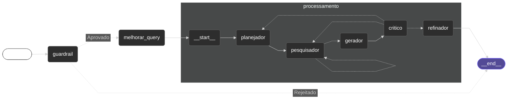
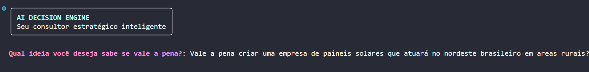
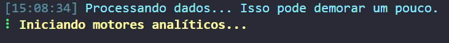
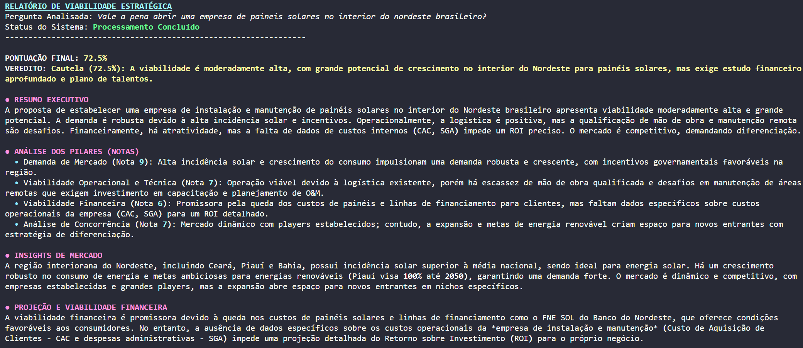
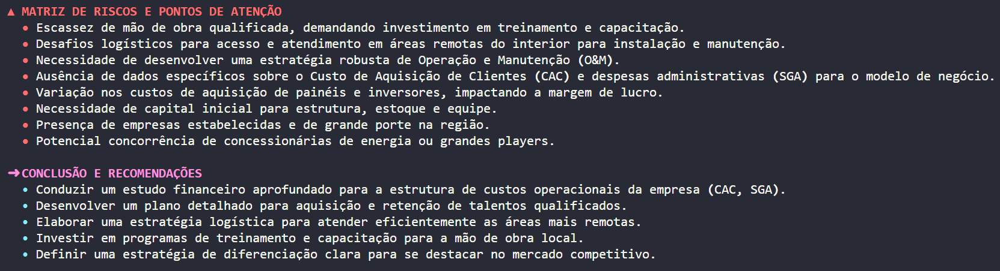

# ai_decision_engine
###### Motor de tomada de decisão baseado em arquitetura multiagente com LangGraph e LangChain.
Ao receber uma ideia, o sistema utiliza uma arquitetura de raciocínio multiagente para analisá-la e gerar um relatório estruturado sobre sua viabilidade. Ao final do processo, os resultados são retornados ao usuário de forma organizada, com suporte a rastreabilidade e análise dos agentes por meio do LangSmith.

<hr>

> O objetivo deste projeto é explorar a construção de sistemas de raciocínio baseados em arquiteturas multiagente, focando em controle de fluxo, observabilidade e iteração estruturada para análise de ideias e tomada de decisão.

<hr>

### Estrutura do projeto:
#### Tecnologias principais:


- **LangChain**: Utilizado para query enhancement, aprimorando o input inicial para aumentar a qualidade das respostas geradas pelos agentes.
- **LangGraph**: Responsável pela construção do grafo de execução e pela orquestração dos agentes, definindo o pipeline de raciocínio do sistema.
- **LangSmith**: *(Opcional)*, Fornece rastreabilidade e observabilidade do fluxo de execução, permitindo análise detalhada do comportamento dos agentes e das decisões tomadas ao longo do processo.

###### Tecnologias auxiliares utilizadas como como suporte à infraestrutura do sistema, validação, integração externa, visualização e apresentação do sistema.


<hr>

#### Fluxo do processamento (Grafo):
1 - **GuardRail**: O fluxo se inicia com um nó de validação responsável por verificar se a ideia fornecida está dentro do escopo esperado e é segura. Caso a entrada não seja aprovada, o processamento é encerrado imediatamente.

<p></p>

2 - **Melhorar Query**: Após a aprovação, a ideia passa por um processo de query enhancement, onde o input é refinado para aumentar clareza, contexto e precisão antes de entrar no núcleo de raciocínio.

<p></p>

3 - **Bloco de Processamento (Core Cognitivo)**:  O núcleo do sistema é composto por um subgrafo responsável pela análise profunda da ideia, dividido nas seguintes etapas:

- **Planejador**: Define a estratégia de análise e organiza os próximos passos.
- **Pesquisador**: Coleta e estrutura informações relevantes pela web com base no plano definido. *(WebScraping)*
- **Gerador**: Produz uma versão bruta da análise ou solução juntando todos os dados gerados.
- **Crítico**: Avalia a qualidade, coerência e possíveis falhas do conteúdo gerado.
- **Refinador**: Ajusta e melhora o resultado com base nas críticas recebidas e gera o relatório final.

4 - **Finalização**: O fluxo é encerrado e devolve a analise completa que é imprimida no terminal via Rich.

###### O grafo permite loops controlados entre essas etapas, possibilitando iteração quando a qualidade do resultado ainda não é considerada satisfatória.


#### Características do Grafo:
- Suporte a iterações condicionais, evitando respostas únicas e pouco robustas.
- Separação clara entre validação, processamento e finalização.
- Totalmente observável via LangSmith quando habilitado.

  
<hr>

### Como configurar?
Clone e entre no repositório:
```
git clone https://github.com/Developer-Marcos/sistema-de-pesquisa-web-inteligente.git
```
```
cd ai_decision_engine/project
```

<hr>

Crie e ative o ambiente virtual:
###### Criando o ambiente virtual (Windows & Linux/macOS)
```
python -m venv .venv
```
###### Acessando por Linux/macOS
```
source .venv/bin/activate.ps1
```
###### Acessando pelo Windows
```
.venv\Scripts\activate.ps1
```

<hr>

Instale as dependências do projeto:
```
pip install -r requirements.txt
```

<hr>

Crie o .env em /project/config com as suas chaves: 
```
GOOGLE_API_KEY = sua chave de API do Gemini
TAVILY_API_KEY = sua chave de API do Tavily
```

<hr>

###### Opcional
#### Observabilidade com o LangSmith: 
Basta colocar as variáveis do LangSmith no .env:
```
LANGSMITH_API_KEY = sua_api_key
LANGCHAIN_TRACING_V2= true
LANGCHAIN_ENDPOINT= https://api.smith.langchain.com
LANGCHAIN_PROJECT= ai-decision-engine
```


<hr>

#### Executando o projeto:
###### Execute o comando pelo terminal na raiz do projeto: ai-decision-engine/
```
python -m project.main
```

<hr>

###### Como usar:
Após a execução, o sistema solicitará uma ideia como entrada e iniciará o fluxo de análise utilizando o grafo de raciocínio multiagente. Ao final do processamento, um relatório estruturado sobre a viabilidade da ideia será exibido no terminal.

Quando habilitado, todo o fluxo de execução pode ser acompanhado no LangSmith.

<hr>

#### Fotos da interface em ordem de execução:




